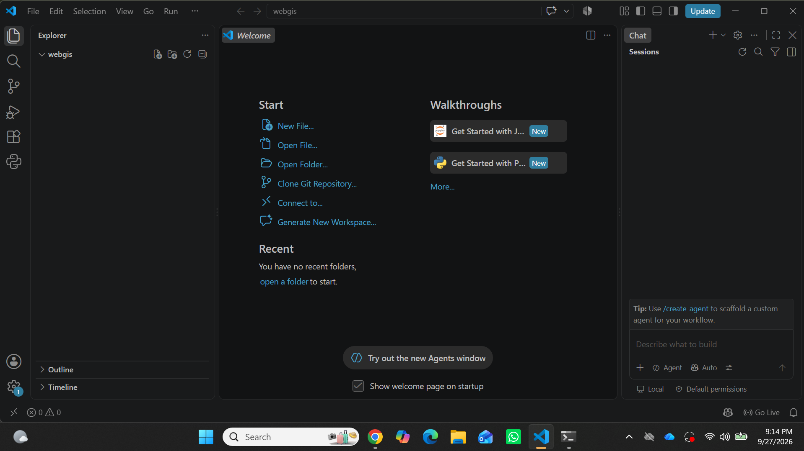
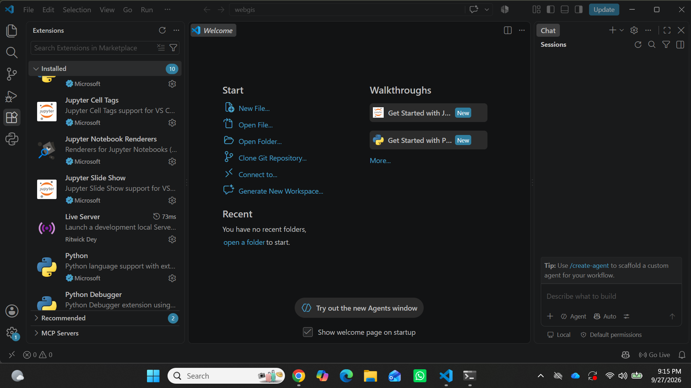
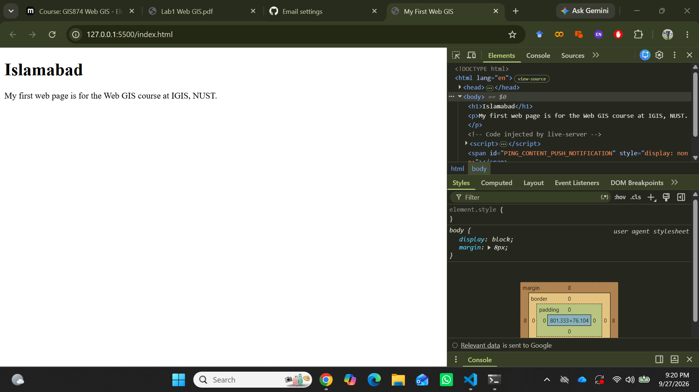
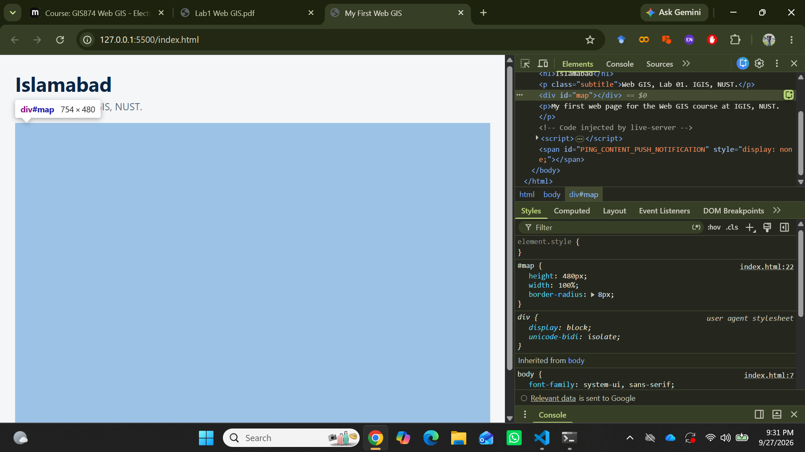
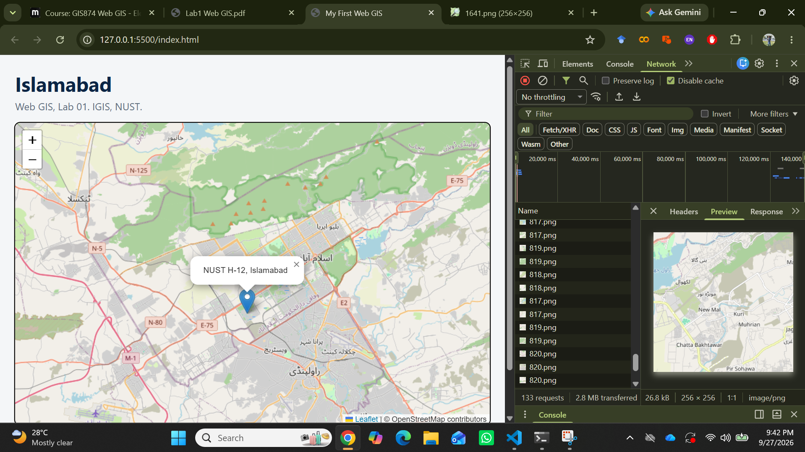
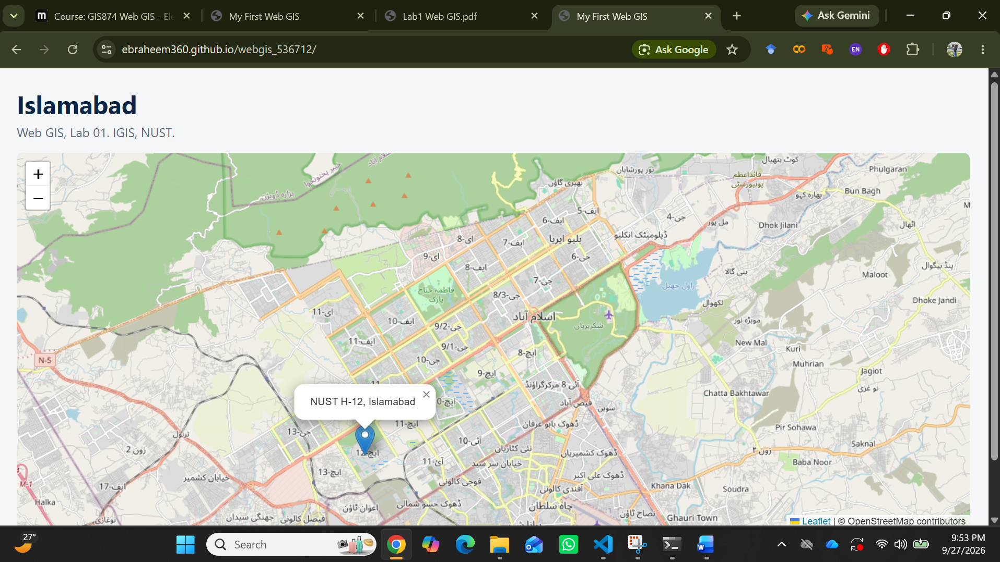

# Lab 01 Report

## Checkpoint 1

## Checkpoint 2

## Checkpoint 3

## Checkpoint 4

## Checkpoint 5

## Checkpoint 6

1. In Part 2 your page made one network request. After Part 4 it made dozens. Explain in two or three sentences what changed and why.

In Part 2, the page only loaded the HTML file, so it made one network request. After Part 4, we added Leaflet and other resources, so the browser had to download several files and map-related resources.

2. What is the difference between what HTML does and what CSS does? Give one example of each from your own file.

HTML creates the structure and content of the webpage. CSS controls the appearance and design of the webpage. For example, <h1>My First Web GIS</h1> is HTML, while body { font-family: system-ui; } is CSS.

3. Why does the #map rule need a height, when the h1 rule does not?

The map needs a height because the map 
 does not automatically have a visible height. The h1 contains text, so it automatically gets a height from the text.

4. You opened your page through Live Server at 127.0.0.1 instead of double-clicking the file. Give one reason this matters.

Live Server opens the webpage through a local web server. This is useful because web maps and external resources can work properly when the page is loaded through a server.

5. A classmate’s marker appears in the sea near Africa instead of in Islamabad. What is almost certainly wrong, and how would you fix it?

The coordinates are probably wrong or written in the wrong order. In Leaflet, coordinates are written as latitude first, then longitude, so Islamabad should be approximately:

L.marker([33.7, 73.0]).addTo(map);

If the coordinates are written as [73.0, 33.7], the marker will appear in the wrong location.